# Code Migration AI — Enterprise Agentic Code Modernization Platform

[](https://fastapi.tiangolo.com)
[](https://python.org)
[](https://react.dev)
[](https://langchain-ai.github.io/langgraph/)
[](https://neo4j.com)
[](https://qdrant.tech)
[](https://postgresql.org)
[](https://redis.io)
[](https://docs.celeryq.dev)
[](https://docker.com)

> **Code Migration AI** is a fully autonomous, multi-agent platform that modernizes legacy enterprise codebases at the AST level — executing framework migrations, generating regression tests, validating in a hermetic Docker sandbox, and opening a pull request with a full audit trail. All with human-in-the-loop governance and real-time streaming of agent reasoning to a premium collaborative UI.

---

## Table of Contents

1. [Platform Vision](#1-platform-vision)
2. [High-Level Architecture](#2-high-level-architecture)
3. [Technology Stack](#3-technology-stack)
4. [Multi-Agent LangGraph Pipeline](#4-multi-agent-langgraph-pipeline)
5. [Repository Intelligence Engine](#5-repository-intelligence-engine)
6. [AI & LLM Gateway Layer](#6-ai--llm-gateway-layer)
7. [Polyglot Persistence Strategy](#7-polyglot-persistence-strategy)
8. [Backend API Reference](#8-backend-api-reference)
9. [Distributed Task Execution (Celery)](#9-distributed-task-execution-celery)
10. [Real-Time WebSocket Streaming](#10-real-time-websocket-streaming)
11. [Hermetic Sandbox Execution](#11-hermetic-sandbox-execution)
12. [Frontend Application](#12-frontend-application)
13. [Authentication & Authorization](#13-authentication--authorization)
14. [Subscription & Billing](#14-subscription--billing)
15. [Observability Stack](#15-observability-stack)
16. [CI/CD Pipeline](#16-cicd-pipeline)
17. [Project Structure](#17-project-structure)
18. [Environment Variables](#18-environment-variables)
19. [Local Development Setup](#19-local-development-setup)
20. [Production Deployment](#20-production-deployment)
21. [Security Architecture](#21-security-architecture)
22. [Known Issues & Fixes](#22-known-issues--fixes)

---

## 1. Platform Vision

Legacy codebases represent the single largest source of technical debt for enterprises. Manual migration is slow, expensive, and error-prone. **Code Migration AI** solves this by orchestrating a pipeline of specialized AI agents that:

1. Understand an entire codebase at the **AST level** across 12 programming languages
2. Reason about the **code dependency graph** to plan a topologically safe transformation order
3. Generate an atomic, ordered migration **DAG plan** — requiring human approval before execution
4. **Transform** code file-by-file with LLM generation grounded in real AST data
5. **Validate** output in a hermetically isolated Docker sandbox (lint + type-check + tests)
6. **Self-heal** autonomously on failure with up to 3 reflection retries
7. **Open a Pull Request** with unified diffs and a full migration audit report

### Core Principles

| Principle | Description |
|-----------|-------------|
| **AST-First** | All changes grounded in tree-sitter AST — no hallucinated line numbers |
| **Human-in-the-Loop** | Plan requires explicit user approval before any code is written |
| **Self-Healing** | Validation failures trigger an autonomous reflection loop (max 3×) |
| **Polyglot Persistence** | PostgreSQL / Neo4j / Qdrant / Redis — each database used for its optimal access pattern |
| **Observable** | Agent thoughts, token usage, and system metrics stream in real time |
| **Multi-Provider AI** | OpenAI, Anthropic, Gemini, Groq, Ollama with automatic fallback chain |

---

## 2. High-Level Architecture

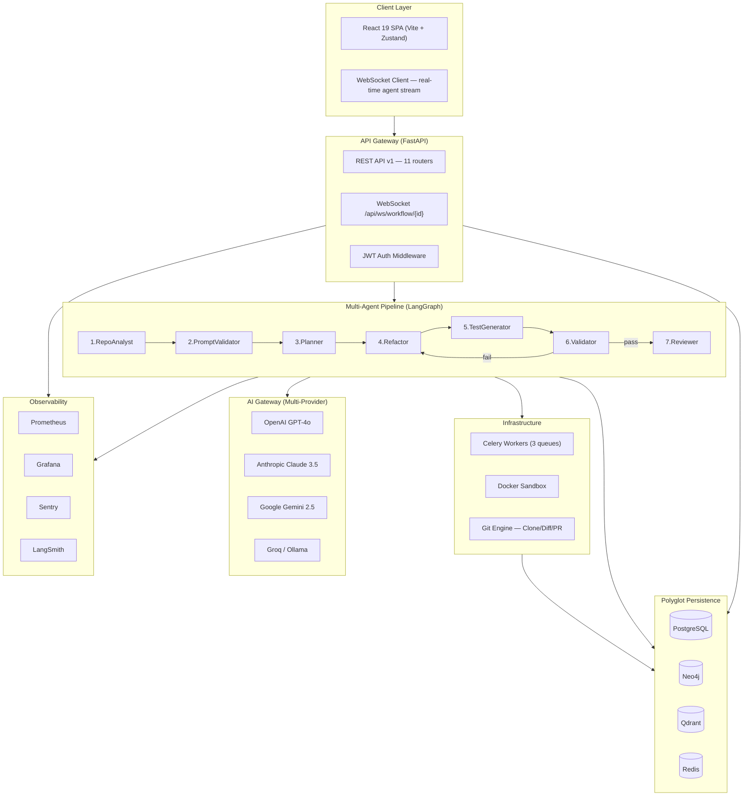

### End-to-End Request Lifecycle

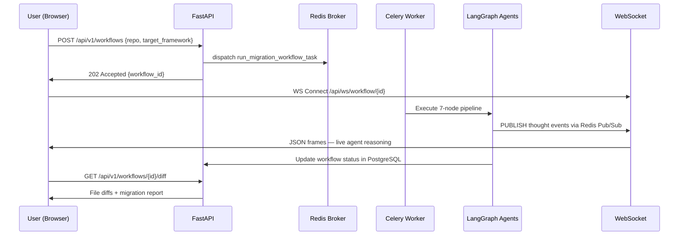

---

## 3. Technology Stack

### Backend

| Layer | Technology | Purpose |
|-------|-----------|---------|
| Web Framework | **FastAPI 0.115+** | Async REST API, WebSocket, auto OpenAPI docs |
| Agent Orchestration | **LangGraph 0.2+** | Stateful multi-agent DAG with conditional routing |
| LLM Tracing | **LangSmith** | Full LLM call trace, replay, and observability |
| Task Queue | **Celery + Redis** | Distributed async workflow execution |
| ORM | **SQLAlchemy 2.0 (async)** | PostgreSQL via asyncpg driver |
| Migrations | **Alembic** | Schema versioning — no runtime `create_all()` |
| Config | **Pydantic-Settings v2** | Type-safe env var loading with validation |
| Logging | **structlog** | JSON structured logs with correlation context |
| AST Parsing | **tree-sitter + tree-sitter-languages** | 12-language AST analysis |
| LLM Clients | **openai, anthropic, google-generativeai, groq** | Multi-provider AI |
| Structured Output | **Instructor** | Pydantic-validated LLM responses (no hallucinated schemas) |
| Auth | **PyJWT, argon2-cffi, Authlib** | JWT + OAuth2 + Argon2id password hashing |
| Payments | **stripe** | SaaS subscription management |
| Metrics | **prometheus-client** | Prometheus metrics exposition |
| APM | **sentry-sdk** | Error tracking and performance |

### Frontend

| Layer | Technology | Purpose |
|-------|-----------|---------|
| Framework | **React 19** | Component UI |
| Build | **Vite** | Dev server and production bundler |
| State | **Zustand** | Global state management |
| HTTP | **Axios** | REST API with auth interceptors + token refresh |
| Diff View | **diff2html / Monaco** | Syntax-highlighted code diffs |
| Graph | **React-Force-Graph** | Interactive dependency graph visualization |
| Routing | **React Router v6** | Client-side SPA routing |

### Infrastructure

| Component | Technology | Purpose |
|-----------|-----------|---------|
| Containers | **Docker + Docker Compose** | Service orchestration |
| Graph DB | **Neo4j 5** | Code dependency graph |
| Vector DB | **Qdrant** | Semantic code search embeddings |
| Cache / Broker | **Redis** | Celery broker, pub/sub, event buffer |
| Relational DB | **PostgreSQL 16** | Primary OLTP datastore |
| Metrics | **Prometheus + Grafana** | Dashboards and alerting |
| CI/CD | **GitHub Actions** | Lint → type-check → security → test → deploy |

---

## 4. Multi-Agent LangGraph Pipeline

### Workflow State

The `MigrationWorkflowState` TypedDict is the single source of truth that flows through every agent node:

```python
class MigrationWorkflowState(TypedDict):
    workflow_id: str
    organization_id: str
    repository_id: str

    # Configuration
    workflow_type: str        # "framework_migration" | "solid_refactor" | ...
    source_framework: str | None
    target_framework: str | None
    custom_goal: str | None

    # Repository analysis
    file_list: list[str]
    detected_languages: list[str]
    ast_summary: dict[str, Any]
    dependency_graph: dict[str, Any]

    # DAG plan
    plan: list[TaskItem]
    current_task_index: int
    is_human_approved: bool

    # Outputs (operator.add = parallel-safe accumulation)
    file_changes: Annotated[list[FileChange], operator.add]
    generated_tests: Annotated[list[dict], operator.add]

    # Quality gate
    validation_results: ValidationResult | None
    reflection_feedback: str | None
    retry_count: int
    max_retries: int

    # Final deliverables
    migration_report: str | None
    pr_url: str | None

    # Telemetry
    thought_stream: Annotated[list[dict], operator.add]
    total_tokens: Annotated[int, operator.add]
    total_cost_usd: Annotated[float, operator.add]
```

### Agent Node State Machine

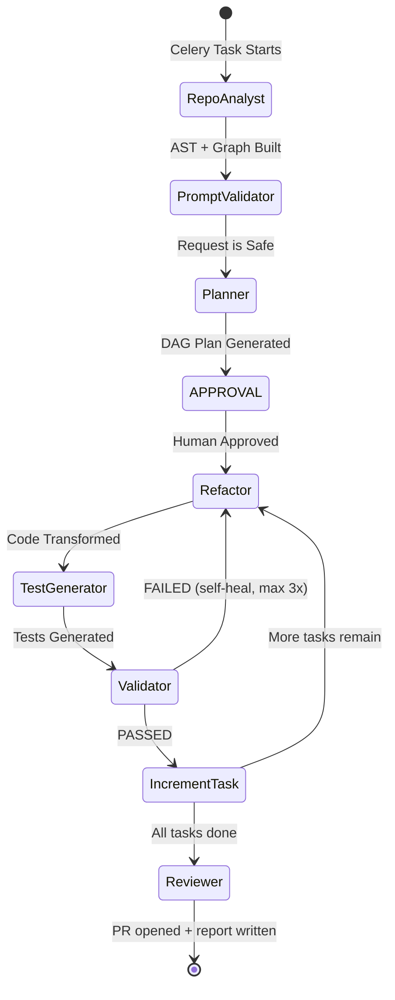

### Agent Responsibilities

| Agent | Node Key | Responsibility |
|-------|----------|----------------|
| **RepoAnalyst** | `repo_analyst` | Clone repo, run AST parsing, build Neo4j dep graph, detect languages and frameworks |
| **PromptValidator** | `prompt_validator` | Safety gate — rejects harmful or infeasible migration requests |
| **Planner** | `planner` | Decomposes migration into ordered DAG of atomic tasks (Instructor + Pydantic output) |
| **Refactor** | `refactor` | Reads source, applies LLM transformations, generates unified diffs |
| **TestGenerator** | `test_generator` | Writes comprehensive pytest regression suite for migrated code |
| **Validator** | `validator` | Runs generated code in Docker sandbox: lint + type-check + tests |
| **Reviewer** | `reviewer` | Generates migration report, commits, opens GitHub Pull Request |

### Conditional Routing

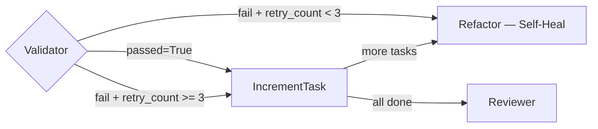

### Cancellation

Every node checks Redis for a user-initiated cancel signal before executing:

```python
if await redis_engine.get_json(f"workflow_cancelled:{state['workflow_id']}"):
    raise asyncio.CancelledError("Cancelled by operator.")
```

### Fault-Tolerant Checkpointing

State is persisted to PostgreSQL via `AsyncPostgresSaver` after every node. Interrupted workflows resume from the last successful node — not from scratch.

---

## 5. Repository Intelligence Engine

Located in `backend/app/infrastructure/repository_intel/`.

### AST Parser (`ast_parser.py`) — 12 Languages

| Language | Extracts |
|----------|---------|
| Python | functions, classes, imports, decorators, call graph |
| JavaScript / TypeScript / TSX | functions, components, imports, exports |
| Java | classes, methods, packages, annotations |
| Go | packages, functions, goroutines |
| Rust | structs, impl blocks, traits |
| C# | namespaces, classes, async methods |
| Ruby | modules, classes, method defs |
| PHP | classes, functions, namespaces |
| C / C++ | functions, structs, includes |

**Version-resilient initialization** handles both tree-sitter API eras:
```python
# 1. Pre-built parser from tree_sitter_languages (preferred)
parser = get_parser(lang)
# 2. Modern API >= 0.22: constructor
parser = Parser(Language(ts_lang))
# 3. Legacy API < 0.22: set_language()
if hasattr(parser, "set_language"): parser.set_language(ts_lang)
```

### Git Engine (`git_engine.py`)
- Clones with GitHub token auth (GitPython)
- Generates unified diffs, creates branches, opens Pull Requests via GitHub REST API

### Semantic Search (`semantic_search.py`)
- Embeds code symbols and docstrings into Qdrant vector collections
- Powers natural language code search: *"find all functions that handle authentication"*

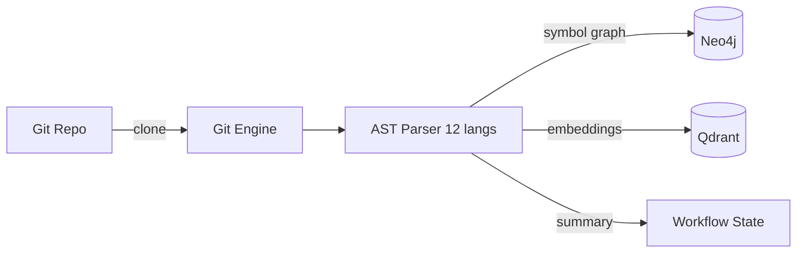

---

## 6. AI & LLM Gateway Layer

Located in `backend/app/infrastructure/ai/`. All providers implement `BaseLLMGateway`:

```python
class BaseLLMGateway(ABC):
    async def generate_text(...) -> LLMResponse
    async def generate_structured(response_model: type[T]) -> T   # Pydantic enforced
    async def stream_text(...) -> AsyncGenerator[str, None]
```

### Provider Matrix

| Gateway | Provider | Default Model | Fallback Order |
|---------|---------|--------------|----------------|
| `OpenAIGateway` | OpenAI | `gpt-4o` | 1st |
| `AnthropicGateway` | Anthropic | `claude-3-5-sonnet-20240620` | 2nd |
| `GeminiGateway` | Google | `gemini-2.5-flash` | 3rd |
| `GroqGateway` | Groq | `qwen/qwen3.6-27b` | 4th |
| `OllamaGateway` | Local Ollama | configurable | 5th |
| `ResilientGateway` | Composite | — | Auto-chain |

### Observability
All calls are `@traceable(run_type="llm")` for LangSmith. Token counts and costs accumulate in workflow state via `Annotated[int, operator.add]` (parallel-safe reducer).

---

## 7. Polyglot Persistence Strategy

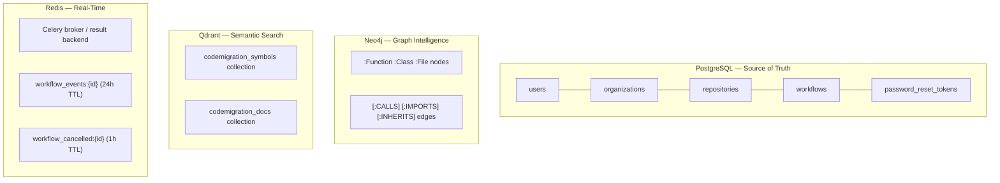

### PostgreSQL Tables

| Table | Key Columns | Purpose |
|-------|------------|---------|
| `organizations` | `id, name, plan_tier, stripe_customer_id` | Multi-tenant entities |
| `users` | `id, email, hashed_password, org_id, google_id` | User accounts |
| `repositories` | `id, org_id, github_url, status, indexed_at` | Connected Git repos |
| `workflows` | `id, org_id, repo_id, type, status, plan_json, total_cost_usd` | Execution history |
| `password_reset_tokens` | `token_hash, user_id, expires_at, used` | Single-use reset tokens |

### Why Neo4j?
The dependency graph lets the Planner determine a **topologically safe migration order**: files that are imported last, base classes before subclasses, callee functions before callers.

---

## 8. Backend API Reference

All routes prefixed `/api/v1`. Auth: `Authorization: Bearer <JWT>`.

### Auth `/auth`

| Method | Path | Description |
|--------|------|-------------|
| POST | `/register` | Register user, create personal org |
| POST | `/login` | Email/password → JWT access + refresh tokens |
| POST | `/refresh` | Rotate access token |
| POST | `/logout` | Invalidate refresh token |
| GET | `/me` | Current user profile |
| PATCH | `/me` | Update name / avatar |
| POST | `/forgot-password` | Send reset email |
| POST | `/reset-password` | Reset with single-use token |
| GET/GET | `/google` `/google/callback` | Google OAuth2 PKCE flow |
| POST | `/change-password` | Change password (auth required) |
| DELETE | `/account` | Delete account |

### Workflows `/workflows`

| Method | Path | Description |
|--------|------|-------------|
| POST | `/` | Launch new migration workflow |
| GET | `/` | Paginated workflow history |
| GET | `/{id}` | Status + event buffer |
| POST | `/{id}/approve` | Human-in-the-loop approval |
| POST | `/{id}/cancel` | Cancel in-progress workflow |
| GET | `/{id}/diff` | All file diffs |
| POST | `/{id}/apply` | Apply diffs to repo branch |
| GET | `/{id}/report` | Download migration report |

### Repositories `/repositories`

| Method | Path | Description |
|--------|------|-------------|
| POST | `/` | Connect a Git repository |
| GET | `/` | List org repos |
| GET | `/{id}` | Repo details + analysis status |
| DELETE | `/{id}` | Disconnect repo |
| POST | `/{id}/index` | Trigger Celery AST indexing |

### Other Routers

| Router | Key Endpoints | Purpose |
|--------|--------------|---------|
| `/chat` | POST `/`, GET/DELETE `/history/{id}` | AI assistant |
| `/search` | POST `/semantic`, POST `/graph` | Code search |
| `/graph` | GET `/{repo_id}` | Dependency graph for visualization |
| `/subscriptions` | POST `/create-checkout`, POST `/webhook`, GET `/portal` | Stripe billing |
| `/metrics` | GET `/`, GET `/tokens` | Platform KPIs and costs |
| `/sandbox` | POST `/execute` | Direct sandbox execution |
| **WebSocket** | `ws://.../api/ws/workflow/{id}` | Real-time agent stream |

---

## 9. Distributed Task Execution (Celery)

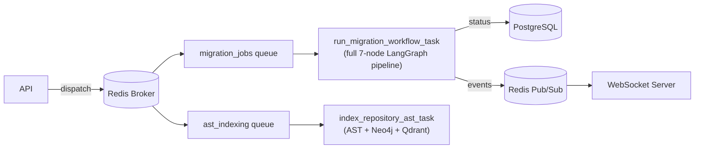

**Key Celery settings:**
- `task_acks_late=True` — task re-queued if worker crashes before ack
- `task_reject_on_worker_lost=True` — no silent task loss
- `worker_concurrency=1` — one LangGraph workflow per worker process
- `task_time_limit=1800` — 30-minute hard kill prevents runaway jobs

**Fault tolerance:** LangGraph uses `AsyncPostgresSaver` to checkpoint state after every node. Interrupted workflows **resume from last successful node** on restart.

---

## 10. Real-Time WebSocket Streaming

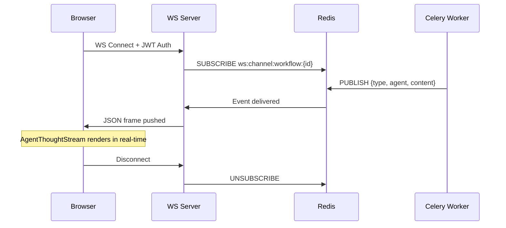

### Event Types

| `type` | Description |
|--------|-------------|
| `thought` | Agent's internal reasoning step |
| `step_complete` | A node finished execution |
| `file_diff` | A file transformation diff is ready |
| `validation_result` | Sandbox output (pass/fail + logs) |
| `workflow_complete` | Pipeline finished |
| `error` | Agent or infrastructure error |

**Reconnect rehydration:** All events are appended to a Redis List (`workflow_events:{id}`, 24h TTL). On reconnect, the frontend fetches the full buffer then subscribes for new events — seamless across tab switches and browser refreshes.

---

## 11. Hermetic Sandbox Execution

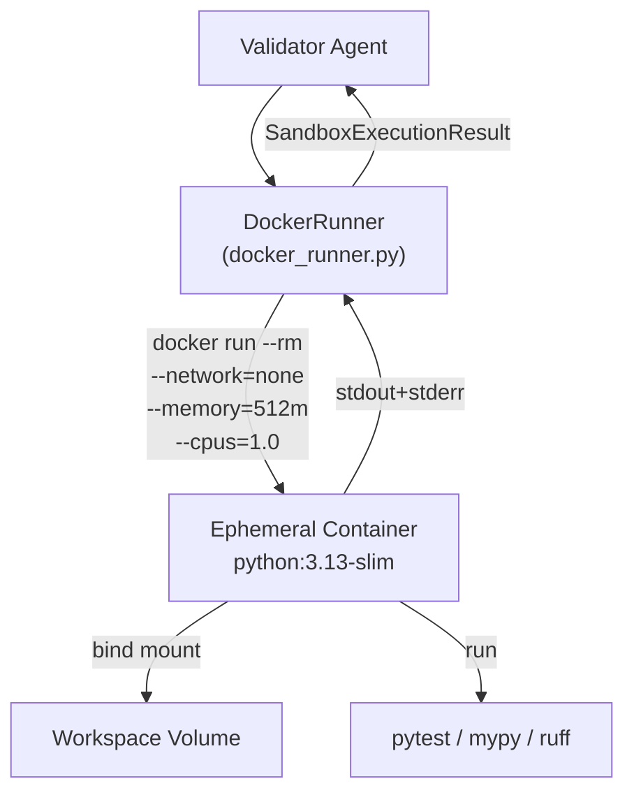

| Security Property | Value | Effect |
|------------------|-------|--------|
| `--network=none` | No network | Prevents exfiltration |
| `--memory=512m` | 512 MB | Prevents OOM exhaustion |
| `--cpus=1.0` | 1 CPU | Prevents host starvation |
| `--rm` | Auto-destroy | No persistent state |
| Timeout | 120s | Kills infinite loops |

---

## 12. Frontend Application

### Pages

| Page | Route | Description |
|------|-------|-------------|
| Login | `/login` | Email/password + Google OAuth |
| Dashboard | `/` | Workflow KPIs, recent activity |
| Migration Studio | `/studio` | Main workspace: select repo → configure → approve plan → watch agent stream → view diffs |
| AI Chat | `/chat` | Conversational code assistant |
| Repository Explorer | `/repositories` | Manage and index repos |
| Workflow History | `/workflows` | Paginated history + filters |
| Reports Page | `/reports` | View and download reports |
| Pricing Page | `/pricing` | Stripe subscription tiers |
| Reset Password | `/reset-password` | Email-based reset |
| Auth Callback | `/auth/callback` | OAuth2 redirect handler |

### Key Components

| Component | Description |
|-----------|-------------|
| `AgentThoughtStream.jsx` | Renders live WebSocket frames as streaming agent reasoning |
| `DiffViewer.jsx` | Side-by-side syntax-highlighted code diffs |
| `DependencyGraphView.jsx` | Interactive force-directed Neo4j graph |
| `ConnectRepoModal.jsx` | GitHub repo connection wizard |
| `AppErrorBoundary.jsx` | Global error boundary with recovery UI |

### State & Services

```
src/stores/        authStore · workflowStore · repoStore · uiStore
src/services/      api.js (Axios + interceptors) · workflowService · repoService · authService
src/hooks/         Custom React hooks (useWebSocket, useWorkflow, ...)
```

---

## 13. Authentication & Authorization

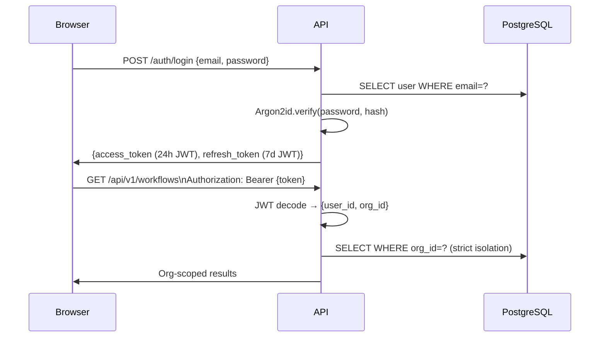

### Security Controls

| Control | Implementation |
|---------|---------------|
| Password hashing | **Argon2id** — memory-hard, GPU-resistant |
| JWT signing | **HS256**, min 32-char secret enforced by Pydantic validator |
| Token rotation | Refresh tokens are single-use, stored as hash |
| Google OAuth | Authlib PKCE flow + CSRF `state` parameter |
| Password reset | Single-use token, 1h expiry, delivered via SMTP |
| Tenant isolation | All DB queries scoped by `org_id` from JWT |
| Production guard | Settings validator blocks deploy with default `SECRET_KEY` |
| LLM safety | `agent_safety_filter` screens all agent outputs |

---

## 14. Subscription & Billing

| Plan | Price | Limits |
|------|-------|--------|
| **Free** | $0/month | 3 workflows, 1 repo |
| **Pro** | $5/month | Unlimited workflows, 10 repos, priority queue |
| **Unlimited** | $200/month | Unlimited, dedicated worker, SLA |

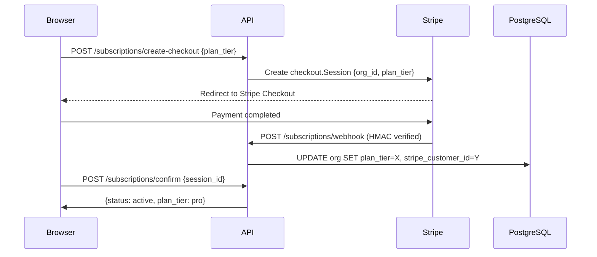

---

## 15. Observability Stack

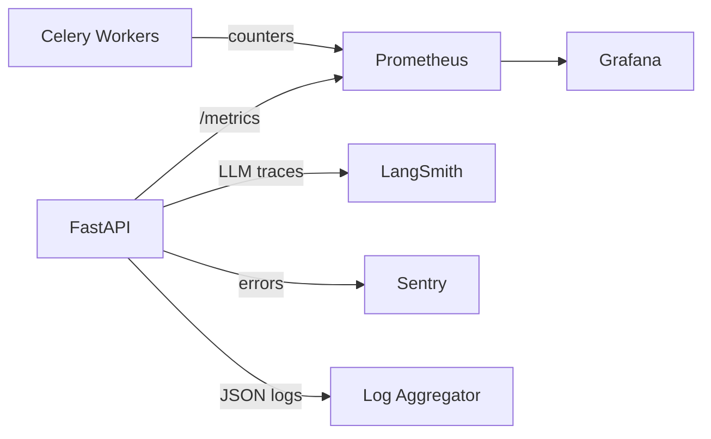

### Prometheus Metrics

| Metric | Type | Description |
|--------|------|-------------|
| `codemigration_workflows_total` | Counter | Total workflows by status and type |
| `codemigration_workflow_duration_seconds` | Histogram | End-to-end pipeline time |
| `codemigration_llm_tokens_used_total` | Counter | Token consumption by provider/model |
| `codemigration_ast_parse_duration_seconds` | Histogram | AST parse time per language |
| `codemigration_active_workflows` | Gauge | Currently running workflows |

**Grafana** at `http://localhost:3001` (admin/admin) — Dashboards: Platform Overview, LLM Cost Monitor, API Performance, Error Rates.

**Structured logs** (structlog): JSON in production, colorized console in development. Every log carries `workflow_id`, `logger`, `level`, `timestamp`.

---

## 16. CI/CD Pipeline

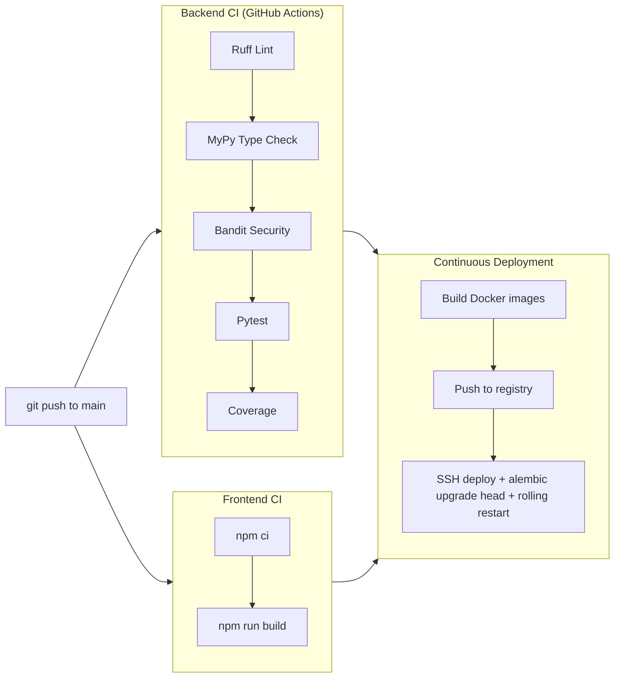

| Gate | Tool | Blocking |
|------|------|---------|
| Code style | Ruff | ✅ Yes |
| Static types | MyPy | ✅ Yes |
| Security | Bandit | ✅ Yes |
| Unit tests | Pytest | ✅ Yes |
| Frontend build | Vite | ✅ Yes |

---

## 17. Project Structure

```
Code Migration AI/
├── .github/workflows/
│   ├── ci.yml               # Lint + type + security + test
│   └── cd.yml               # Build + push + SSH deploy
├── backend/
│   ├── app/
│   │   ├── api/v1/          # 11 REST routers (auth, workflows, repos, chat, search, ...)
│   │   ├── core/            # config.py · logging.py · telemetry.py · token_counter.py
│   │   ├── domain/          # migration/ · refactoring/engine.py
│   │   └── infrastructure/
│   │       ├── agents/
│   │       │   ├── nodes/   # planner · prompt_validator · refactor · repo_analyst · reviewer · test_generator · validator
│   │       │   ├── prompts.py · safety.py · state.py · workflow.py
│   │       ├── ai/          # base.py · factory.py (all 5 LLM providers)
│   │       ├── database/    # neo4j/ · postgres/ · qdrant/ · redis/
│   │       ├── repository_intel/  # ast_parser · ast_visitors · git_engine · semantic_search
│   │       └── sandbox/     # docker_runner.py
│   │   └── main.py          # FastAPI app + lifespan + 12 routers
│   ├── alembic/             # Database migration versions
│   ├── tests/               # Pytest unit + integration tests
│   ├── celery_app.py        # Celery app + task definitions
│   ├── pyproject.toml       # Ruff + MyPy + Pytest config
│   └── Dockerfile
├── frontend/
│   ├── src/
│   │   ├── components/      # AgentThoughtStream · DiffViewer · DependencyGraphView · ...
│   │   ├── pages/           # 10 pages (Dashboard · MigrationStudio · AIChat · ...)
│   │   ├── services/        # api.js · workflowService · repoService · authService
│   │   ├── stores/          # 4 Zustand stores
│   │   └── App.jsx
│   └── Dockerfile
├── config/prometheus/prometheus.yml
├── docker-compose.yml       # Full stack: API + Celery + Frontend + Prometheus + Grafana
├── .env.example
└── README.md
```

---

## 18. Environment Variables

Copy `.env.example` to `.env`:

```env
# Core
ENVIRONMENT=development
SECRET_KEY=<run: python -c "import secrets; print(secrets.token_hex(32))">
FRONTEND_URL=http://localhost:5173

# PostgreSQL
POSTGRES_SERVER=localhost
POSTGRES_PORT=5432
POSTGRES_USER=postgres
POSTGRES_PASSWORD=your_password
POSTGRES_DB=codemigration_db

# Redis
REDIS_HOST=localhost
REDIS_PORT=6379
CELERY_BROKER_URL=redis://localhost:6379/0

# Neo4j
NEO4J_URI=bolt://localhost:7687
NEO4J_USER=neo4j
NEO4J_PASSWORD=your_password

# Qdrant
QDRANT_HOST=localhost
QDRANT_PORT=6333

# AI (at least one required)
OPENAI_API_KEY=sk-...
ANTHROPIC_API_KEY=sk-ant-...
GEMINI_API_KEY=AIza...
GROQ_API_KEY=gsk_...
DEFAULT_LLM_PROVIDER=openai
DEFAULT_FRONTIER_MODEL=gpt-4o

# Optional
GOOGLE_CLIENT_ID=...
GOOGLE_CLIENT_SECRET=...
STRIPE_SECRET_KEY=sk_live_...
STRIPE_WEBHOOK_SECRET=whsec_...
GITHUB_TOKEN=ghp_...         # Required for PR creation
SENTRY_DSN=https://...
LANGFUSE_PUBLIC_KEY=pk-...
LANGFUSE_SECRET_KEY=sk-...
```

---

## 19. Local Development Setup

**Prerequisites:** Docker Desktop 24+, Python 3.12+, Node.js 20+, Git

```bash
# 1. Clone
git clone https://github.com/sheetanshumohan/Code-Migration-AI.git
cd "Code Migration AI"

# 2. Configure environment
cp .env.example .env    # Fill in API keys

# 3. Launch full stack
docker-compose up --build -d

# 4. Run database migrations
docker exec codemigration-backend-api alembic upgrade head
```

| Service | URL |
|---------|-----|
| Frontend | http://localhost:3000 |
| Backend API | http://localhost:8000 |
| Swagger UI | http://localhost:8000/docs |
| Prometheus | http://localhost:9090 |
| Grafana | http://localhost:3001 (admin/admin) |

### Backend Without Docker

```bash
cd backend
python -m venv .venv && .venv\\Scripts\\activate
pip install -r requirements.txt
uvicorn app.main:app --reload --port 8000

# In a separate terminal:
celery -A celery_app.celery_app worker --loglevel=info -Q migration_jobs,ast_indexing,validation_sandbox
```

### Frontend Without Docker

```bash
cd frontend && npm install && npm run dev   # http://localhost:5173
```

### Running Tests

```bash
cd backend
pytest tests/ -v --cov=app     # Unit + integration
mypy app/ --ignore-missing-imports
ruff check .
bandit -r app/
```

---

## 20. Production Deployment

```bash
# Set in .env: ENVIRONMENT=production, strong SECRET_KEY, cloud DB URIs
docker-compose up -d --build
docker exec codemigration-backend-api alembic upgrade head
```

### Production Checklist

- [ ] `ENVIRONMENT=production` — triggers Pydantic secret validator
- [ ] `SECRET_KEY` — fresh `secrets.token_hex(32)` value
- [ ] All cloud database URIs configured (PostgreSQL, Redis, Neo4j, Qdrant)
- [ ] At least one AI provider API key set
- [ ] `GITHUB_TOKEN` for PR creation
- [ ] Stripe keys for billing
- [ ] SSL/TLS termination at Nginx or load balancer
- [ ] Backend port `8000` bound to `127.0.0.1` only (already in docker-compose)
- [ ] Sentry DSN and Grafana admin password updated

---

## 21. Security Architecture

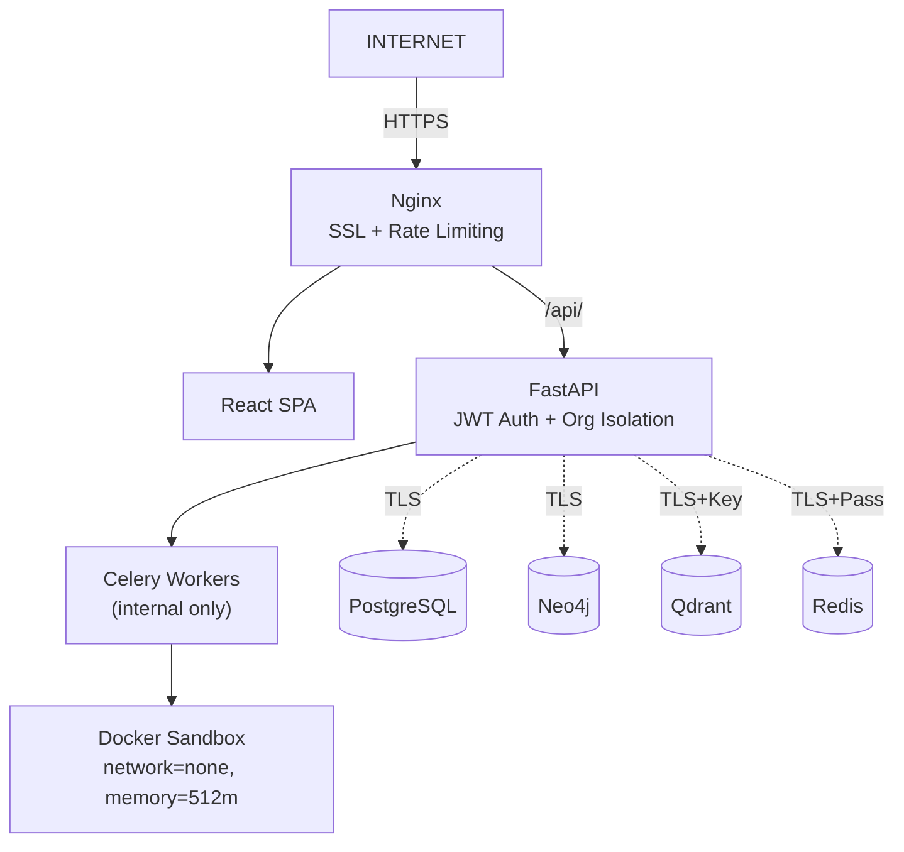

| Layer | Control |
|-------|---------|
| Network | Nginx SSL, CORS whitelist, backend on localhost only |
| Auth | Argon2id passwords, HS256 JWT, single-use refresh, OAuth PKCE |
| Authorization | All queries scoped by `org_id` from JWT |
| Sandbox | Docker `--network=none`, CPU+memory capped, auto-destroyed |
| Secrets | Pydantic blocks default `SECRET_KEY` in production |
| SAST | Bandit on every CI push |
| Webhook | Stripe HMAC signature verified before processing |
| LLM | `agent_safety_filter` screens all agent I/O |

---

## 22. Known Issues & Fixes

### Tree-Sitter API Compatibility

**Issue:** `AttributeError: Parser has no attribute 'set_language'` with `tree-sitter >= 0.22.0`

**Fix:** Three-tier initialization in `ast_parser.py`:
1. `tree_sitter_languages.get_parser(lang)` — preferred, no API concerns
2. `Parser(Language(ts_lang))` — modern constructor API (>= 0.22.0)
3. `parser.set_language(ts_lang)` — guarded by `hasattr` check (< 0.22.0)

### Stripe Metadata Safety

**Issue:** `AttributeError` when `session.retrieve()` returns a `StripeObject` instead of `dict`

**Fix:** `getattr(session, "metadata", None)` + `hasattr(meta, "get")` guard in `subscriptions.py`

### MyPy Static Typing

63 errors across 19 files resolved via:
1. `disable_error_code` list in `pyproject.toml` for dynamic library imports (structlog, prometheus_client)
2. Explicit `list[str]` annotation on `security_vulnerabilities` in `validator.py`

---

## License

Enterprise License — All Rights Reserved.
Contact [sheetanshumohan1@gmail.com](mailto:sheetanshumohan1@gmail.com) for licensing.

---

*Code Migration AI — Agentic Code Modernization Platform v1.0.0 | Built by Kush Agarwal*