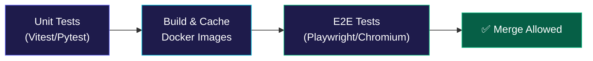

# Code Migration AI | Enterprise Agentic Code Modernization Platform

[](https://fastapi.tiangolo.com)
[](https://python.org)
[](https://react.dev)
[](https://langchain-ai.github.io/langgraph/)
[](https://neo4j.com)
[](https://qdrant.tech)
[](https://postgresql.org)
[](https://playwright.dev)
[]()

> **Code Migration AI** is an industry-grade, autonomous multi-agent platform engineered to modernize legacy enterprise codebases, execute complex framework migrations (e.g., Python 2/3, Flask to FastAPI, React Class Components to Vite & Hooks, Java 8 to 21), generate comprehensive regression test suites, and deliver AST-verified Pull Requests with zero hallucinations and strict human-in-the-loop governance.

---

## 🏛️ System Architecture

Code Migration AI is built upon **Clean Architecture (Hexagonal)** and **Domain-Driven Design (DDD)** principles. It utilizes a Polyglot Persistence strategy to optimize data storage based on access patterns and data shapes.

### High-Level Component Diagram

```mermaid
flowchart TD
    subgraph Frontend [Modern Developer Cockpit]
        UI[React 19 Vite SPA]
        Monaco[Monaco Diff Editor]
        Flow[React Flow DAG View]
        UI --- Monaco
        UI --- Flow
    end

    subgraph Edge [Ingress]
        Nginx[Nginx Edge Proxy]
    end

    subgraph Backend [FastAPI Application]
        API[FastAPI Core (Py 3.13)]
        Auth[JWT & RBAC]
        WS[WebSocket Manager]
        API --- Auth
        API --- WS
    end

    subgraph Compute [Distributed Agentic Workers]
        Celery[Celery Workers]
        AgentPlanner[Planner Agent]
        AgentAnalyst[Repo Analyst Agent]
        AgentRefactor[Refactoring Agent]
        AgentTest[Test Generation Agent]
        AgentValidator[Sandbox Validator Agent]
        
        Celery --> AgentPlanner
        Celery --> AgentAnalyst
        Celery --> AgentRefactor
        Celery --> AgentTest
        Celery --> AgentValidator
    end

    subgraph Sandbox [Hermetic Execution]
        Docker[Docker Sandboxes]
        Linters[Ruff / MyPy / Semgrep]
        Runners[Pytest / Vitest]
        Docker --- Linters
        Docker --- Runners
    end

    subgraph Persistence [Polyglot Database Tier]
        PG[(PostgreSQL 16\nState & Auth)]
        Neo4j[(Neo4j 5\nAST Call Graphs)]
        Qdrant[(Qdrant\nVector Embeddings)]
        Redis[(Redis 7\nBroker & Cache)]
    end

    UI <-->|HTTPS / WSS| Nginx
    Nginx <--> API
    API <--> Persistence
    API -->|Task Queue| Celery
    Celery <--> Persistence
    Celery <--> Sandbox
```

---

## 🤖 The LangGraph Multi-Agent Team

At the core of the platform is a distributed cluster of specialized AI agents orchestrated by **LangGraph**. They work collaboratively to refactor code:

1. **Planner Agent:** Ingests the migration goal, breaks it down into discrete steps, and maps dependencies.
2. **Repo Analyst Agent (AST):** Leverages `Tree-sitter` to parse multi-language grammars into Abstract Syntax Trees. It calculates symbol slicing, circular dependencies, and blast radiuses.
3. **Refactoring & Migration Agent:** Generates the actual transformed code. Aware of modern standards (e.g., async/await, modern hooks, strict typing).
4. **Test Generation Agent:** Writes unit and integration tests to cover the newly refactored code.
5. **Sandbox Validation Agent:** Deploys the code and tests into a hermetic Docker container. Runs linters, type-checkers, and test suites. If failures occur, it triggers a self-healing reflection loop back to the Refactoring Agent.
6. **Reviewer & PR Creator Agent:** Packages the final verified code into a GitHub Pull Request for human review.

---

## 🗄️ Polyglot Persistence Tier

We utilize four distinct database engines, each chosen for a highly specific architectural purpose:

*   **PostgreSQL 16 (Relational State):** Handles ACID-compliant transactional state, user authentication, RBAC, organizations, billing, and system audit trails. Managed via Alembic migrations.
*   **Neo4j 5 (Graph State):** Stores deep AST node hierarchies, function call graphs, and dependency maps. Crucial for calculating the "blast radius" of a code change.
*   **Qdrant (Vector State):** High-speed vector search engine. Stores code embeddings to enable semantic search, duplicate pattern matching, and retrieval-augmented generation (RAG).
*   **Redis 7 (In-Memory Broker):** Powers the Celery task queue, manages high-frequency WebSocket pub/sub for real-time agent thought streaming to the frontend, and caches KPI metrics.

---

## 🖥️ Modern Developer Cockpit (Frontend)

The frontend is a robust, responsive Single Page Application built for extreme scale and visualization.

*   **Core Stack:** React 19, Vite, Tailwind CSS, Zustand (State).
*   **Data Fetching:** TanStack React Query + Axios (JWT Interceptors).
*   **Live Telemetry:** Real-time WebSocket connections stream Agent Thoughts and system KPIs directly to the UI.
*   **AST Visualization:** Uses `@xyflow/react` (React Flow) to map out complex Neo4j dependency graphs interactively.
*   **Code Diffing:** Integrates `@monaco-editor/react` to provide VS Code-level side-by-side diffing of legacy vs. modernized code.

---

## 🛡️ Security, Governance & Sandboxing

*   **Hermetic Docker Execution:** AI-generated code is **never** executed on the host. It is deployed into ephemeral, network-isolated Docker containers with strict CPU, RAM, and timeout quotas.
*   **Static Analysis First:** All code is scanned by tools like `Ruff`, `MyPy`, `Bandit`, and `Semgrep` before execution.
*   **OWASP Mitigation:** Pre-prompt secret redaction, SQL injection-proof parameterized queries (SQLAlchemy 2.0).
*   **Audit Trails:** Append-only SHA-256 integrity-hashed audit logs for compliance.

---

## 🧪 Testing & CI/CD Pipeline

Code Migration AI utilizes a strict, 3-stage CI/CD pipeline powered by GitHub Actions (`ci.yml` and `e2e.yml`).

### 1. Unit & Component Testing
*   **Backend:** Comprehensive coverage using `pytest`, `pytest-asyncio`, and `httpx`.
*   **Frontend:** `vitest` and `@testing-library/react` covering components, complex state hooks, error boundaries, and UI logic (62+ assertions across 14 suites).

### 2. End-to-End (E2E) Integration Testing
Playwright drives a full headless browser test suite against the live Docker Compose stack.
*   **Auth Gates:** Validates JWT flows, global setup, and session persistence.
*   **API Integrity:** Verifies all REST endpoints and WebSocket handshakes.
*   **Navigation Smoke Tests:** Iterates through every protected route to prevent lazy-loading crashes or white screens of death.

### CI/CD Workflow Diagram


---

## 🛠️ Quick Start & Self-Hosting

### Prerequisites
*   Docker Engine 24+ and Docker Compose v2+
*   Node.js 20+ (for local frontend dev)
*   Python 3.13+ (for local backend dev)

### Launch Entire Platform via Docker Compose
```bash
# 1. Clone repository
git clone https://github.com/enterprise/codemigration-ai.git
cd codemigration-ai

# 2. Copy environment template
cp .env.example .env

# 3. Add your LLM keys in .env
# OPENAI_API_KEY=sk-...
# ANTHROPIC_API_KEY=sk-...

# 4. Start all services (PostgreSQL, Neo4j, Qdrant, Redis, Backend, Celery, Frontend, Nginx)
docker-compose up --build -d

# 5. Access the web interface
# Web App:      http://localhost:3000
# API Docs:     http://localhost:8000/api/v1/docs
```

> **Note on Build Times:** The first `docker-compose up --build` will take several minutes as it pulls base images and installs heavy global packages (Numpy, Pandas, etc.). Subsequent builds are optimized with Docker BuildKit caching and will be near-instantaneous.

---

## 📚 Architectural Decision Records (ADRs)
*   [ADR-001: LangGraph Multi-Agent Orchestration](docs/ADR/ADR-001-multi-agent-orchestration-engine.md)
*   [ADR-002: Polyglot Persistence Architecture](docs/ADR/ADR-002-polyglot-database-architecture.md)
*   [ADR-003: Tree-sitter AST & Symbol Intelligence](docs/ADR/ADR-003-ast-and-symbol-intelligence.md)
*   [ADR-004: Hermetic Container Sandboxing](docs/ADR/ADR-004-sandbox-execution-and-validation.md)
*   [ADR-005: Multi-LLM Provider Abstraction](docs/ADR/ADR-005-multi-llm-provider-abstraction.md)
*   [ADR-006: Pure JavaScript React Frontend Architecture](docs/ADR/ADR-006-frontend-technology-architecture.md)

---

*Code Migration AI — Engineered for the Autonomous Future.*
